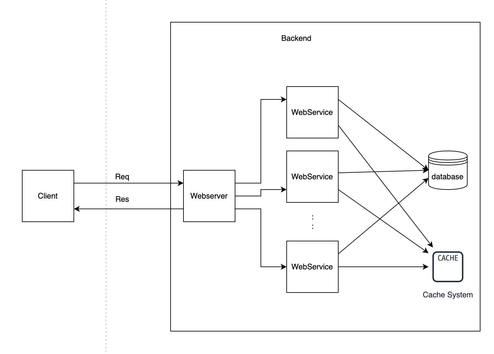
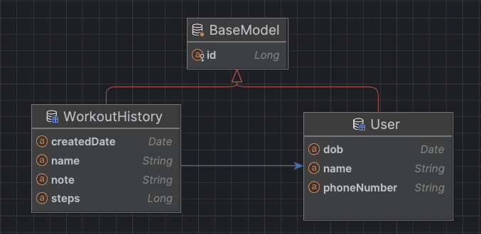

## Coding round

### Architecture

Hệ thống sẽ bao gồm 1 webserver (LB) và 1 hoặc nhiều service chạy dịch vụ (Tuỳ theo cấu hình scale up) connect đến database system và cache system.

Cấu hình môi trường: 
  - SDK: openjdk version "19.0.2"
  - Gradle: gradle-7.1
  - Mariadb: 11.1.2-MariaDB-1:11.1.2+maria~ubu2204 (image docker latest version)

Cấu trúc source code

- src
  - main
    - java
      - com.ht.tracker
        - user: Package nghiệp vụ chứa các layer Entity, Repository, Service, Controller liên quan user
        - utils
          - BaseModel: Chứa các field common cho 1 entity
          - BaseService: Chứa các hàm cơ bản 1 service cần
          - BaseServiceImpl: Implement BaseService
          - ...
        - workout_history: Package nghiệp vụ chứa các layer Entity, Repository, Service, Controller liên quan workout history

Mô hình các entity trong hệ thống

### Database structure

See script [here](./src/main/resources/scripts/schema.sql)

1. User (user)
    - Lưu trữ thông tin client

    | Field        | Type         | Null | Key     | Description  |
    |--------------|--------------|------|---------|--------------|
    | id           | INT unsigned | No   | Primary | User id      |
    | name         | VARCHAR(100) | No   |         | Client name  |
    | phone_number | VARCHAR(15)  | Yes  | Unique  | Phone number |
    | dob          | DATE         | Yes  |         |              |

2. Workout history (workout_history)
    - Lưu trữ lịch sử workout của client

    | Field        | Type         | Null | Key     | Description             |
    |--------------|--------------|------|---------|-------------------------|
    | id           | INT unsigned | No   | Primary | Id workout history      |
    | user_id      | INT unsigned | No   | FOREIGN | User Id                 |
    | name         | VARCHAR(200) | No   |         | Type of workout         |
    | note         | TEXT         | Yes  |         | Note                    |
    | steps        | INT unsigned | No   |         | Steps                   |
    | created_date | DATE         | No   |         | Date workout is created |

    - Bảng lưu trữ nhiều dữ liệu, cần thao tác truy vấn liên tục 
   => Cần đánh partition theo created_date theo tháng